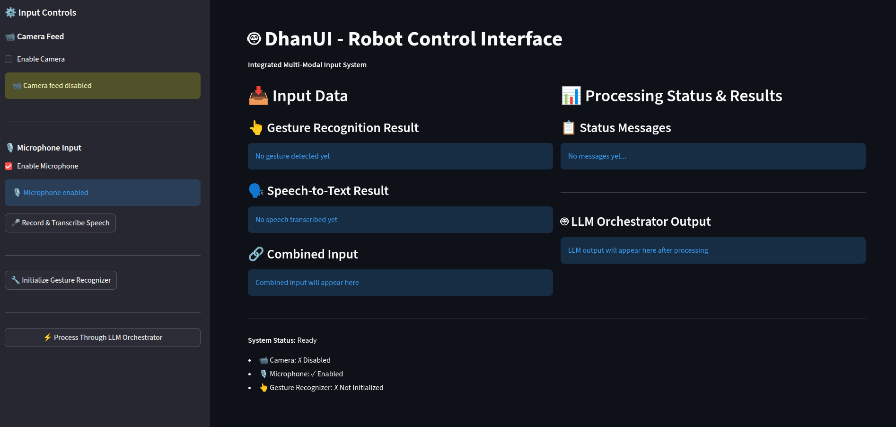

# DhanUI - Robot Control Interface


A comprehensive Streamlit application for multi-modal robot control integrating camera feed, microphone input, gesture recognition, speech-to-text, and LLM-based task orchestration.

## Home Page



## Quick Start

### Prerequisites
- Python 3.10 or higher
- Linux/macOS/Windows

### Setup Instructions

#### 1. Create Virtual Environment
```bash
python3 -m venv hackvenv
```

#### 2. Activate Virtual Environment
```bash
# On Linux/macOS:
source hackvenv/bin/activate

# On Windows:
hackvenv\Scripts\activate
```

#### 3. Install Dependencies
```bash
pip install -r requirements.txt
```

#### 4. Configure Environment Variables
Create a `.env` file in the project root with your API key:
```
CEREBRAS_API_KEY=your_cerebras_api_key_here
```

#### 5. Run the Application
```bash
streamlit run Frontend_Streamlit/front_end.py
```

The application will open in your default browser at `http://localhost:8501`

## Features

- 📹 **Camera Feed** - Real-time video capture with placeholder support
- 🎙️ **Microphone Input** - Speech-to-text transcription
- 👆 **Gesture Recognition** - MediaPipe-based hand gesture detection
- 🤖 **LLM Orchestration** - Cerebras LLM for task planning
- 📊 **Real-time Status** - Timestamped processing updates
- 📋 **Structured Output** - JSON-formatted task instructions

## Project Structure

```
Frontend_Streamlit/     # Streamlit application
MediaPipe_Model/        # Gesture recognition models
S2LLM_Cerb/            # LLM and speech processing
requirements.txt        # Python dependencies
```

## Support

For detailed information, architecture overview, and troubleshooting, contact the Team.
